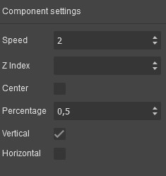

# Grapesjs Rellax

[](https://www.npmjs.com/package/grapesjs-rellax)


[DEMO](https://jsfiddle.net/ry593hex)

## Summary

* Plugin name: `grapesjs-rellax`
* Components
    * `rellax-content`
* Blocks
    * `rellax-content`

This plugin is a wrapper for the [Rellax.js](https://dixonandmoe.com/rellax/) library. It allows you to add parallax effects to your website.
When you add the `rellax-content` you are able to edit the following properties:



## Options

| Option      | Description                   | Default |
|-|-|-
| `rellaxCDN` | URL to the Rellax.js CDN      | `https://cdn.jsdelivr.net/gh/dixonandmoe/rellax@master/rellax.min.js` |
| `i18n`      | Internationalization options  | `{}` |

## Download

* CDN
  * `https://unpkg.com/grapesjs-rellax`
* NPM
  * `npm i grapesjs-rellax`
* GIT
  * `git clone https://github.com/nicolasgassen/grapesjs-rellax.git`

## Usage

Directly in the browser
```html
<link href="https://unpkg.com/grapesjs/dist/css/grapes.min.css" rel="stylesheet"/>
<script src="https://unpkg.com/grapesjs"></script>
<script src="path/to/grapesjs-rellax.min.js"></script>

<div id="gjs"></div>

<script type="text/javascript">
  var editor = grapesjs.init({
      container: '#gjs',
      // ...
      plugins: ['grapesjs-rellax'],
      pluginsOpts: {
        'grapesjs-rellax': { /* options */ }
      }
  });
</script>
```

Modern javascript
```js
import grapesjs from 'grapesjs';
import plugin from 'grapesjs-rellax';
import 'grapesjs/dist/css/grapes.min.css';

const editor = grapesjs.init({
  container : '#gjs',
  // ...
  plugins: [plugin],
  pluginsOpts: {
    'grapesjs-rellax': { /* options */ }
  }
  // or
  plugins: [
    editor => plugin(editor, { /* options */ }),
  ],
});
```


## Development

Clone the repository

```sh
$ git clone https://github.com/nicolasgassen/grapesjs-rellax.git
$ cd grapesjs-rellax
```

Install dependencies

```sh
$ npm i
```

Start the dev server

```sh
$ npm start
```

Build the source

```sh
$ npm run build
```


## License

MIT
